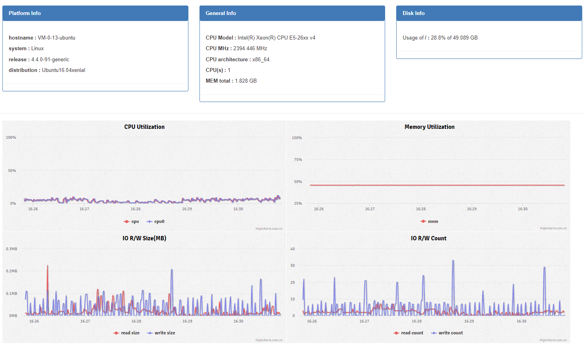

NaviCore System Performance Monitor
===================================

A web service to monitor realtime system performance.

It provides both HTML pages and APIs.

An example site: http://211.159.171.115/nc/v1/system_monitor/

部署
----

软件安装
........

.. code-block:: shell

    sudo apt-get install nginx
    sudo apt-get install python-dev
    wget https://bootstrap.pypa.io/get-pip.py && sudo python get-pip.py
    sudo pip install flup==1.0 psutil

Nginx配置
.........

在 /etc/nginx/sites-enabled/default 的 nginx 配置中增加以下配置:

.. code-block:: json

    location ~ ^/system_monitor/api/v1(?<path_info>/.*)$
    {
        include fastcgi_params;
        fastcgi_param SCRIPT_FILENAME /scripts$fastcgi_script_name;
        fastcgi_param PATH_INFO $path_info;
        fastcgi_pass unix:/etc/ncserver/system-monitor/.ncserver.sock;
    }

    location /nc/v1/system_monitor
    {
        alias /etc/ncserver/system-monitor/html;
        index index.html;
    }

配置完成后重启软件

.. code-block:: shell

    sudo service nginx restart

部署软件
........

.. code-block:: shell

    git clone https://github.com/NavInfoNC/system-monitor.git
    cd system-monitor
    sudo ./deploy.sh
    cd /etc/ncserver/system-monitor/
    sudo python httpServer.py

Dependency
----------

linux: lscpu

python-lib: psutil, flup1.0

API
---

前缀 PREFIX 为::

   http://<hostname>/<sock_url_prefix>

如果没有特殊说明，都是GET请求。

发起服务器性能统计请求
----------------------

Request::

    GET /performance/start_collecting?hash=<hash>&duration=<duration>&interval=<interval>&server=<server>

注：
    <hash>:在请求端通过MD5("URL_PREFFIX;PID;CurrentTimestamp")计算出来
    <duration>:采集持续时长
    <interval>:采集间隔
    <server>:采集指定服务的性能信息

Response:

.. code-block:: jss

    {
        "result":"succeeded/failed",
    }

处理逻辑:

    如果query不完整，则Response中的result字段为failed，否则返回succeed

停止服务器性能统计请求
----------------------

Request::

    GET /performance/stop_collecting?hash=<hash>

Response:

.. code-block:: jss

    {
        "result":"succeeded/failed",
        "system":PerformanceInfo,
        "process":PerformanceInfo
    }

    PerformanceInfo =
    {
        "cpu":CpuInfo
        "memory":MemoryInfo
        "io":IoInfo
        "disk":DiskInfo[]
        "platform":PlatformInfo
    }

    CpuInfo =
    {
        "percent":[],
        "coreNum":
        "corePercent":[[],[],[]]
        "architecture":
        "model":
        "MHz":
    }

    MemoryInfo =
    {
        "percent":[],
        "used":[],
        "total":totalSize,
    }

    IoInfo =
    {
        "readSize":[],
        "writeSize":[],
        "readCount":[],
        "writeCount":[],
    }

    PlatformInfo =
    {
        "version":version,
        "hostname":hostname,
        "system":system,
        "release":release
        "distribution":distribution
    }

    DiskInfo =
    {
        "mountPoint":mountPoint
        "device":device
        "total":total,
        "used":used
    }

处理逻辑:

    如果在发起服务器性能请求时，没有server名称，代理将只采集system的性能指标
    request中的散列与代理端存储的散列值一致，则返回代理中采集的性能指标，result为succeed，否则为failed

实时采集服务器性能数据
----------------------

Request::

    GET /performance/real_time

Response:

.. code-block:: jss

    {
        "result":"succeeded/failed",
        "system":PerformanceInfo,
    }

